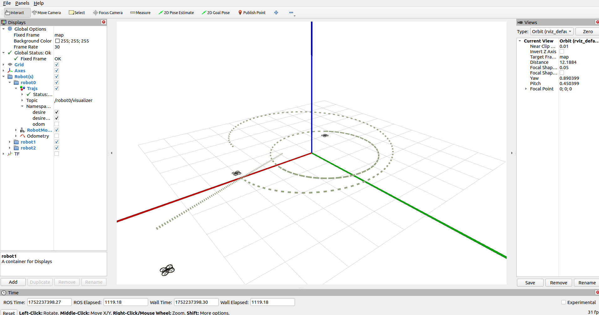

# ROS2_MPC
基于ROS2Humble的多智能体MPC轨迹跟踪控制Demo
- MPC算法使用Osqp-Eigen库实现
- 模型采用二阶积分器，Python实现



## DEMO
    ```
    git clone git@github.com:DaydayXtt/ROS2_MPC.git
    cd ROS2_MPC/
    colcon build
    source install/setup.bash
    
    ros2 launch mpc main.launch.py
    ---
    ros2 launch mpc visualize.launch.py
    ```
## 0. 环境准备
- CMake-v3.22.1、Eigen-v3.4.0、osqp-v1.0.0、osqp-eigen-v0.10.0
- Python3 3.10.12
- ```sudo apt install libyaml-cpp-dev```
- ...

## 1. ```mpc```功能包
- 功能：使用OSQP实现MPC控制
    ```
    ros2 launch mpc main.launch.py
    ---
    ros2 launch mpc visualize.launch.py
    ```
- 参考：https://robotology.github.io/osqp-eigen/md_pages_mpc.html
### TODO:
1. x、y、z三维
2. 尝试CBF

## 2. ```odoms```功能包
- 功能：Python建立积分器模型
    ```
    ros2 run odoms integrator.launch.py
    ```
1. 一阶积分器
    - 速度控制```/cmd_vel```
        ```
        ros2 topic pub -r 0.5 /${namespace}/cmd_vel geometry_msgs/msg/Twist "{linear: {x: 0.5, y: 0.0, z: 0.0}, angular: {x: 0.0, y: 0.0, z: 0.1}}"
        ```
2. 二阶积分器
    - 加速度控制```/input_accel```
        ```
        ros2 topic pub -r 10 /${namespace}/input_accel geometry_msgs/msg/Accel "{linear: {x: 0.1, y: -0.5, z: -0.2}}"
        ```
### TODO:
...

## TroubleShooting:
1. 运行时节点时而崩溃——在于[mpc_controller.cpp中solver.getSolution();](https://github.com/DaydayXtt/ROS2_MPC/blob/main/src/mpc/src/utils/mpc_controller.cpp#207)
   - 加入系列安全测试
2. ```git pull --rebase origin main```
   - 将远程分支 (origin/main) 的最新更改同步到本地分支，同时 重新应用（rebase） 你本地的提交
   - 将你的本地提交“移动”到 origin/main 的最新提交之后，使历史保持线性
